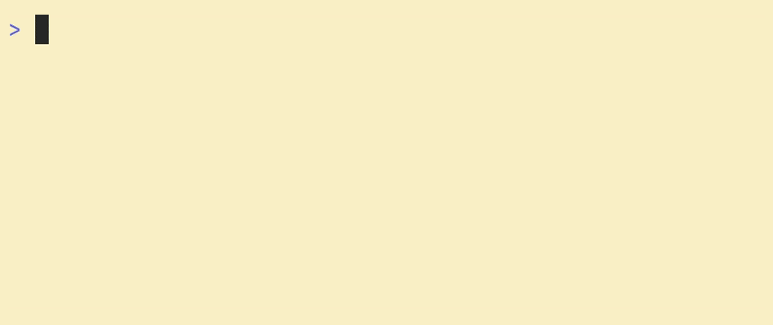

# NixOS health checks

(a.k.a. smoke tests)

NixOS flake to write health checks as options, intended to be written right next
to the service definitions to verify right after deployment or whenever you like
if your services are running correctly.



## How to define checks

`nixos-healthchecks.nixosModules.default` provides the
[NixOS Option](https://wiki.nixos.org/wiki/NixOS_modules) `healthchecks`, to
define your service checks.

### Check the http responses

```nix
healthchecks.http.nextcloud = {
  url = "https://example.com/login";
  expectedContent = "Login";
};
```

### check if a port is actually closed

```nix
healthchecks.closed.public.host = "example.com";
healthchecks.closed.public.ports.opentelemetry = [ 4317 ];
```

### custom command

```nix
healthchecks.localCommand.bashTest = pkgs.writers.writeBash "test" ''
  echo "this is a bash test"
'';
healthchecks.localCommand.pythonTest = pkgs.writers.writePython "test" {} ''
  print("this is a python test")
'';
```

**Failure** or **Success** is decided on **exit code** of the script. The output
of the command will only be printed if the **exit code** is not 0.

## How to set up with flake parts

You have to import the `nixos-healthchecks.flakeModule` and the
`nixos-healthchecks.nixosModules.default`.

```nix
{

  inputs = {
    flake-parts.inputs.nixpkgs-lib.follows = "nixpkgs";
    flake-parts.url = "github:hercules-ci/flake-parts";
    nixos-healthchecks.inputs.nixpkgs.follows = "nixpkgs";
    nixos-healthchecks.url = "github:mrvandalo/nixos-healthchecks";
    nixpkgs.url = "github:nixos/nixpkgs/nixos-unstable";
  };

  outputs =
    inputs@{
      flake-parts,
      nixos-healthchecks,
      nixpkgs,
      self,
    }:

    flake-parts.lib.mkFlake { inherit inputs; } (
      { }:
      {
        systems = [ "x86_64-linux" ]; # feel free to use other systems

        # 1. import healthchecks flakeModule
        imports = [ nixos-healthchecks.flakeModule ];

        flake = {
          nixosConfigurations.example = inputs.nixpkgs.lib.nixosSystem {
            system = "x86_64-linux";
            modules = [
              ./configuration.nix
              
              # 2. import healthchecks nixosModule
              nixos-healthchecks.nixosModules.default
            ];
          };
        }; 
      }
    );
}
```
